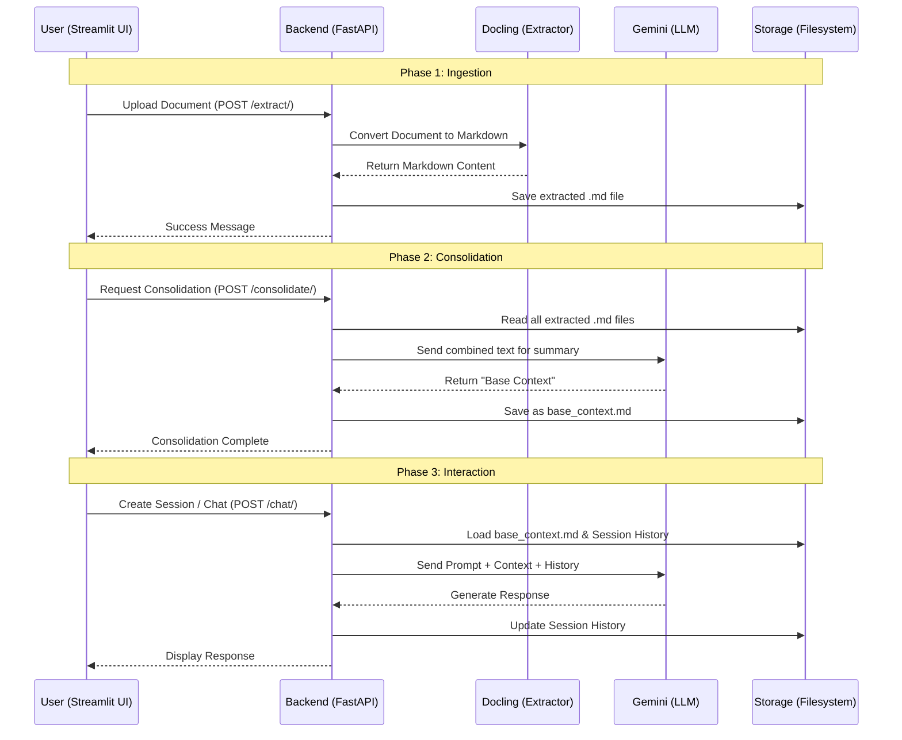

# 📚 Book Generation & Knowledge Base Chat

Welcome to the **Book Generation Pipeline**. This robust application allows you to transform static documents (PDFs, DOCX, TXT, MD) into an interactive Knowledge Base. By leveraging powerful Large Language Models (Gemini 2.5 Flash), it enables you to extract content, consolidate insights, and engage in meaningful conversations with your data.

## 🌟 Key Features

*   **📄 Universal Document Support**: Seamlessly upload and process `.pdf`, `.docx`, `.txt`, and `.md` files.
*   **🧩 Intelligent Extraction**: Powered by `docling` to accurately parse formatting and content from your uploads.
*   **🧠 Context Consolidation**: Merges multiple documents into a single, cohesive "Base Context" for unified understanding.
*   **💬 Interactive Chat with History**: Engage in multi-turn conversations. The system remembers previous interactions (session management) for a natural chat experience.
*   **🎛️ Customizable Model**: Adjust temperature settings to control the creativity vs. precision of the AI responses.
*   **🚀 Modern Stack**: Built with **FastAPI** for a high-performance backend and **Streamlit** for a responsive, user-friendly interface.

---

## 🏗️ Architecture

The system follows a modular extraction-consolidation-retrieval pattern:



---

## 🛠️ Technology Stack

*   **Language**: Python 3.9+
*   **Frontend**: [Streamlit](https://streamlit.io/)
*   **Backend**: [FastAPI](https://fastapi.tiangolo.com/)
*   **AI Model**: [Google Gemini 2.5 Flash](https://deepmind.google/technologies/gemini/)
*   **Document Processing**: [Docling](https://github.com/DS4SD/docling)
*   **Server**: Uvicorn

---

## 🚀 Getting Started

Follow these steps to set up the project locally.

### Prerequisites

*   Python 3.10 or higher installed.
*   A Google Cloud Project with the **Gemini API** enabled.
*   An API Key for Gemini.

### 1. Clone the Repository

```bash
git clone <repository_url>
cd <project_directory>
```

### 2. Environment Setup

Create a `.env` file in the root directory and add your Gemini API key. You can use the provided example as a template:

```bash
cp .env.example .env
```

Open `.env` and fill in your key:

```env
GEMINI_API_KEY=your_actual_api_key_here
```

### 3. Install Dependencies

It is recommended to use a virtual environment:

```bash
# Create virtual environment
python -m venv venv

# Activate (Windows)
.\venv\Scripts\activate

# Activate (macOS/Linux)
source venv/bin/activate
```

Install the required packages:

```bash
pip install -r requirements.txt
```

---

## ▶️ How to Run

You need to run both the Backend (API) and the Frontend (UI) terminals.

### Terminal 1: Backend (FastAPI)

Start the API server. This handles all file processing and AI communications.

```bash
uvicorn app.main:app --reload
```

*The API will start at `http://127.0.0.1:8000`.*

### Terminal 2: Frontend (Streamlit)

Launch the user interface.

```bash
streamlit run streamlit_app.py
```

*The UI will automatically open in your browser at `http://localhost:8501`.*

---

## 📖 Usage Guide

1.  **Upload**: Go to the sidebar and upload your PDF or DOCX files. click **Process Uploaded Files**.
2.  **Consolidate**: Once files are processed, click **Generate Base Context** in the sidebar. This merges all your documents into the AI's "brain".
3.  **Chat**:
    *   Create a **New Chat** session.
    *   Adjust the **Temperature** slider if you want more creative answers.
    *   Type your question in the chat box. The AI will answer based *strictly* on the documents you uploaded.

---

## 📂 Project Structure

```
├── app/
│   ├── main.py          # FastAPI entry point & endpoints
│   ├── chat.py          # Logic for communicating with Gemini
│   ├── consolidator.py  # Logic for summarizing documents
│   └── history.py       # Session history management
├── consolidated_docs/   # Stores the merged knowledge base
├── extracted_docs/      # Stores intermediate markdown files
├── uploaded_files/      # Stores raw uploaded documents
├── streamlit_app.py     # Main frontend application
├── requirements.txt     # Python dependencies
└── .env                 # API Keys (Excluded from Git)
```

---

## 🤝 Contributing

Contributions are welcome! Please fork the repository and submit a pull request for any enhancements or bug fixes.

---

## 📄 License

This project is open-source. Please see the LICENSE file for more details.
